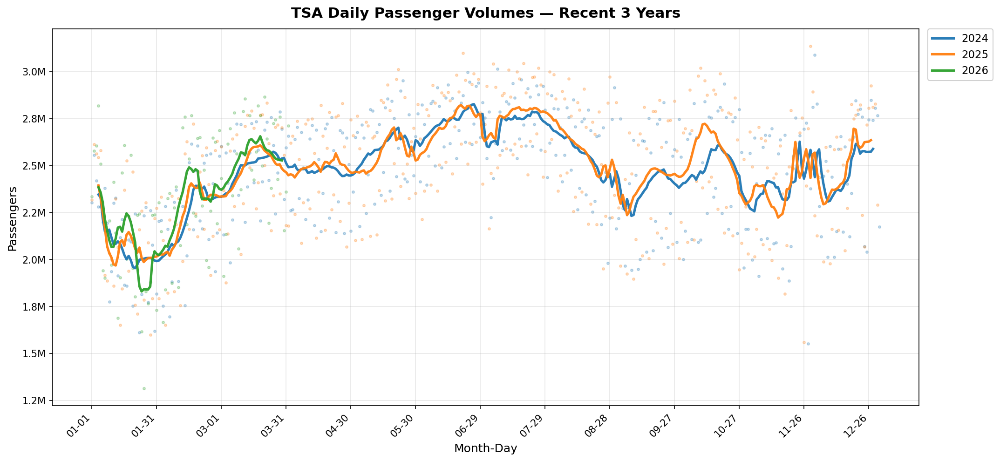
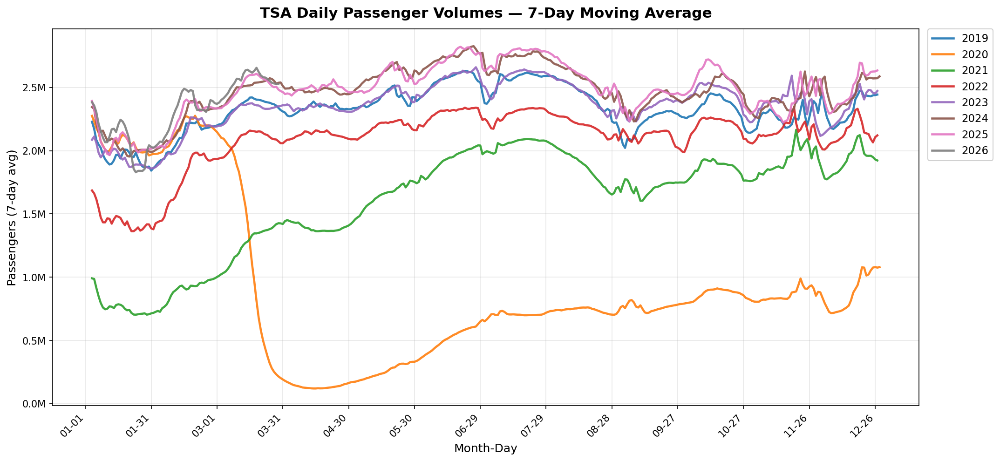
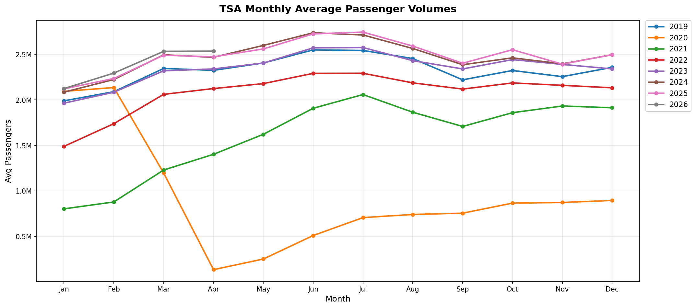
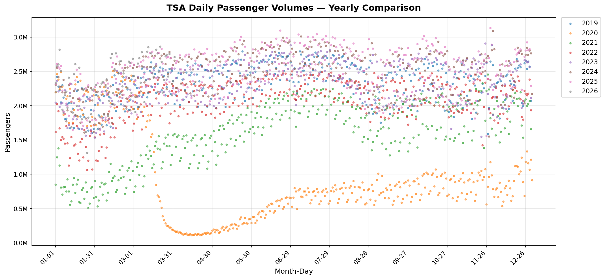

# TSA Passenger Volume Tracker

自动追踪美国运输安全管理局（TSA）每日旅客安检量——美国航空出行需求的实时晴雨表。

**数据来源**：[tsa.gov/travel/passenger-volumes](https://www.tsa.gov/travel/passenger-volumes) · 每日更新

---

## 最新数据

<!-- STATS_START -->
> **数据截至** 2026-04-02 &nbsp;·&nbsp; **更新于** 2026-04-06

### 各年份数据概览

| 年份 | 天数 | 累计客流 | 日均客流 | 数据区间 |
|:----:|-----:|---------:|---------:|---------|
| **2026** | 92 | 213,731,646 | 2,323,170 | 2026-01-01 ~ 2026-04-02 |
| 2025 | 365 | 906,735,976 | 2,484,208 | 2025-01-01 ~ 2025-12-31 |
| 2024 | 366 | 904,068,577 | 2,470,133 | 2024-01-01 ~ 2024-12-31 |
| 2023 | 365 | 858,548,196 | 2,352,187 | 2023-01-01 ~ 2023-12-31 |
| 2022 | 365 | 760,071,362 | 2,082,387 | 2022-01-01 ~ 2022-12-31 |
| 2021 | 365 | 585,250,987 | 1,603,427 | 2021-01-01 ~ 2021-12-31 |
| 2020 | 366 | 339,774,756 | 928,346 | 2020-01-01 ~ 2020-12-31 |
| 2019 | 365 | 848,102,043 | 2,323,567 | 2019-01-01 ~ 2019-12-31 |

### 2026 年 YTD 增长率（vs 历年同期）

| 对比年份 | 增长率 | 当前 YTD | 同期客流 |
|:--------:|:------:|---------:|---------:|
| vs 2019 | **▲ +8.31%** | 213,731,646 | 197,331,526 |
| vs 2020 | **▲ +31.63%** | 213,731,646 | 162,370,428 |
| vs 2021 | **▲ +135.24%** | 213,731,646 | 90,857,798 |
| vs 2022 | **▲ +31.11%** | 213,731,646 | 163,021,930 |
| vs 2023 | **▲ +9.05%** | 213,731,646 | 195,986,860 |
| vs 2024 | **▲ +2.32%** | 213,731,646 | 208,884,380 |
| vs 2025 | **▲ +1.80%** | 213,731,646 | 209,958,389 |

<!-- STATS_END -->

---

## 图表

### 近 3 年趋势（散点 + 7 日均线）


### 历年 7 日移动平均对比


### 月度季节性规律


### 历年原始日数据对比


---

## 使用方法

```bash
# 日常更新（抓取最新数据 + 刷新图表和 README）
python script/update.py

# 补录历史年份
python script/update.py --year 2025

# 仅重新生成图表（不联网）
python script/update.py --charts-only
```

Windows 用户可直接双击 `update_tsa_data.bat`。

详细文档见 [script/README.md](script/README.md)。
